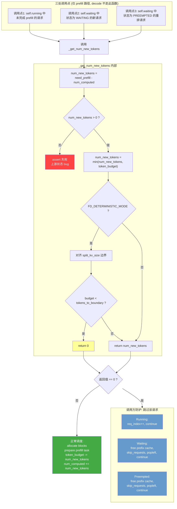

# _get_num_new_tokens 调度逻辑

## 关键字段说明

| 字段 | 含义 | 初始值 |
|------|------|--------|
| `need_prefill_tokens` | 请求**总共需要 prefill 多少 token** | `len(prompt_token_ids)`，即 prompt 的 token 数 |
| `num_computed_tokens` | 已经**计算完成了多少 token** 的 KV cache | 0 |
| `token_budget` | 当前调度轮次中**还能分配给 prefill 的 token 总额** | `max_num_batched_tokens`，每调度一个请求就扣减 |

差值 `need_prefill - num_computed` 就是**还剩多少 token 没算**。

Chunked prefill 示例（prompt = 100 tokens，每轮 budget 允许 40）：

```
第1轮: num_computed=0,  分配 num_new_tokens=40 → num_computed 变 40
第2轮: num_computed=40, 分配 num_new_tokens=40 → num_computed 变 80
第3轮: num_computed=80, 分配 num_new_tokens=20 → num_computed 变 100 (prefill 完成, 转 decode)
```

prefill 完成后（`num_computed >= need_prefill`），请求转入 decode 阶段，不再调用 `_get_num_new_tokens`。

## 流程图



## 设计要点

### 1. assert 守入口不变量

`need_prefill_tokens > num_computed_tokens` 是进入 `_get_num_new_tokens` 的前置条件。三处调用方在调用前已隐式保证了这一点：

- Running 队列：在 `else: # need to prefill` 分支，条件是 `num_computed < need_prefill`
- Waiting 队列（WAITING / PREEMPTED）：请求本身还没完成 prefill

如果走到 assert 却 `<= 0`，说明上游状态管理有 bug（如 `num_computed_tokens` 被多加了），应该 fail fast 暴露问题，而不是 `return 0` 静默吞掉。

### 2. 调用方 `== 0` 防护守合法返回值

`_get_num_new_tokens` 在两种合法场景下会返回 0：

| 场景 | 原因 |
|------|------|
| **Deterministic mode** | `token_budget` 不足以对齐到下一个 `split_kv_size` 边界，显式 `return 0` |
| **`token_budget` 耗尽** | `min(num_new_tokens, token_budget=0)` = 0（running 队列无 `budget > 0` 前置检查） |

返回 0 后如果不防护，会导致：
- `_prepare_prefill_task(request, 0)` 调度空 prefill 任务，下游 engine 处理空 batch 出错
- `request.num_computed_tokens += 0` 无进展，waiting 队列可能死循环

### 3. 三处调用点的防护策略不同

| 调用点 | 防护方式 | 原因 |
|--------|---------|------|
| **Running 队列** | `req_index += 1; continue` | 用下标遍历，+1 即跳到下一个请求；请求留在 running 中，下轮 budget 充足时重新处理 |
| **Waiting 队列 (WAITING)** | `free prefix cache → skip_requests.append → popleft → continue` | waiting 是 deque，不 pop 会死循环处理同一个 `waiting[0]`；移入 skip_requests 后会被追加到队尾 |
| **Waiting 队列 (PREEMPTED)** | 同上 | 同上逻辑 |
