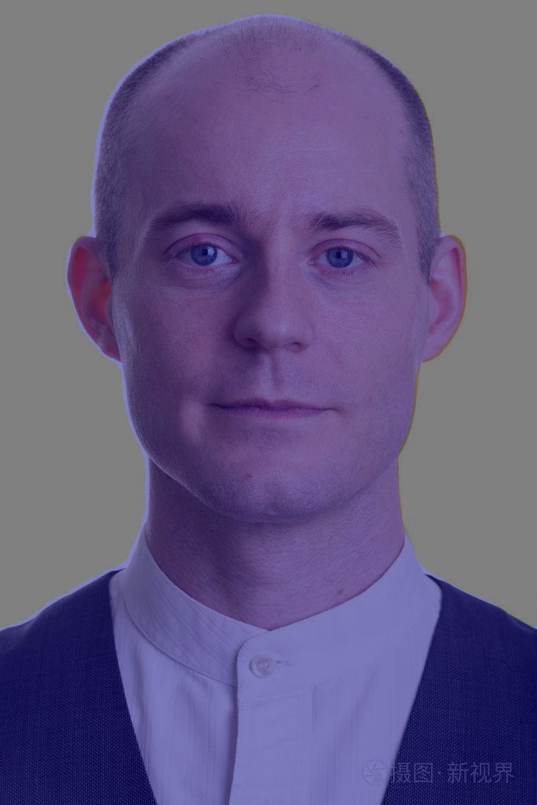

# PaddleSeg C++部署示例

本目录下用于展示PaddleSeg系列模型在RKNPU2上的部署，以下的部署过程以PPHumanSeg为例子。

在部署前，需确认以下两个步骤:

1. 软硬件环境满足要求
2. 根据开发环境，下载预编译部署库或者从头编译FastDeploy仓库

以上步骤请参考[RK2代NPU部署库编译](../../../../../docs/cn/build_and_install/rknpu2.md)实现

## 生成基本目录文件

该例程由以下几个部分组成
```text
.
├── CMakeLists.txt
├── build  # 编译文件夹
├── image  # 存放图片的文件夹
├── infer_cpu_npu.cc
├── infer_cpu_npu.h
├── main.cc
├── model  # 存放模型文件的文件夹
└── thirdpartys  # 存放sdk的文件夹
```

我们需要先生成目录结构
```bash
mkdir build
mkdir image
mkdir model
mkdir thirdpartys
```


```bash

```

## 转换模型

RKNPU部署模型前需要将模型转换成RKNN模型，其过程一般可以简化为如下步骤:
*   Paddle动态图模型 -> Paddle静态图模型 -> ONNX模型 -> RKNN模型。
    *   对于Paddle动态图模型 -> Paddle静态图模型 -> ONNX模型的过程我将其放在了AIStudio上，大家Fork项目后可一键运行体验。
        ```text
        我发现了一篇高质量的实训项目，使用免费算力即可一键运行，还能额外获取8小时免费GPU运行时长，快来Fork一下体验吧。
        模型集市——Paddle系列模型ONNX合集：https://aistudio.baidu.com/aistudio/projectdetail/4618218?contributionType=1&sUid=790375&shared=1&ts=1667027805784
        ```
    *   对于ONNX模型 -> RKNN模型的过程，我将其集成在[LuFeng仓库](https://github.com/Zheng-Bicheng/LuFeng)中，请参考[文档](https://github.com/Zheng-Bicheng/LuFeng/blob/main/docs/export.md)进行转换。

以PPHumanSeg为例，在获取到ONNX模型后，其转换步骤如下:
* 下载LuFeng仓库
    ```bash
    git clone https://github.com/Zheng-Bicheng/LuFeng.git
    ```
* 编写config.yaml文件
    ```yaml
    model_path: ./portrait_pp_humansegv2_lite_256x144_pretrained.onnx
    output_folder: ./
    target_platform: RK3588
    normalize:
    mean: [0.5,0.5,0.5]
    std: [0.5,0.5,0.5]
    outputs: None
    ```
* 执行转换代码
    ```bash
    python tools/export.py  --config_path=./config.yaml
    ```
  
## 编译

### 编译并拷贝SDK到thirdpartys文件夹

请参考[RK2代NPU部署库编译](../../../../../docs/cn/build_and_install/rknpu2.md)仓库编译SDK，编译完成后，将在build目录下生成
fastdeploy-0.0.3目录，请移动它至thirdpartys目录下.

### 拷贝模型文件，以及配置文件至model文件夹
在Paddle动态图模型 -> Paddle静态图模型 -> ONNX模型的过程中，将生成ONNX文件以及对应的yaml配置文件，请将配置文件存放到model文件夹内。
转换为RKNN后的模型文件也需要拷贝至model，我这里提供了转换好的文件，输入以下命令下载使用(模型文件为RK3588，RK3568需要重新转换模型)。
```bash
cd model
wget https://bj.bcebos.com/fastdeploy/models/rknn2/human_pp_humansegv2_lite_192x192_pretrained_3588.tgz
tar xvf human_pp_humansegv2_lite_192x192_pretrained_3588.tgz
```

### 准备测试图片至image文件夹
请下载测试图片至image文件夹

### 编译example

```bash
cd build
cmake -DTARGET_SOC=RK3588 ..
make -j8
make install
```

## 运行例程

```bash
cd ./build/install
./rknpu_test
```

## 运行结果展示
运行后将在install文件夹下生成human_pp_humansegv2_lite_npu_result.jpg文件，如下图:


## PaddleSeg C++接口

### PaddleSeg类

```c++
fastdeploy::vision::segmentation::PaddleSegModel(
        const string& model_file,
        const string& params_file = "",
        const string& config_file,
        const RuntimeOption& runtime_option = RuntimeOption(),
        const ModelFormat& model_format = ModelFormat::PADDLE)
```

**参数**

> * **model_file**(str): 模型文件路径
> * **params_file**(str): 参数文件路径
> * **config_file**(str): 推理部署配置文件
> * **runtime_option**(RuntimeOption): 后端推理配置，默认为None，即采用默认配置
> * **model_format**(ModelFormat): 模型格式，要使用NPU进行推理这里需要配置为ModelFormat::RKNN

### Predict函数

> ```c++
> PaddleSegModel::Predict(cv::Mat* im, DetectionResult* result)
> ```
>
> 模型预测接口，输入图像直接输出检测结果。
>
> **参数**
>
> > * **im**: 输入图像，注意需为HWC，BGR格式
> > * **result**: 分割结果，包括分割预测的标签以及标签对应的概率值, SegmentationResult说明参考[视觉模型预测结果](../../../../../docs/api/vision_results/)

### DisableNormalizeAndPermute函数

> ```c++
> PaddleSegModel::DisableNormalizeAndPermute()
> ```
>
> 关闭模型normalize和nhwc操作。
> **参数**
> 
> 无具体参数


### 类成员属性
#### 预处理参数
用户可按照自己的实际需求，修改下列预处理参数，从而影响最终的推理和部署效果

> > * **is_vertical_screen**(bool): PP-HumanSeg系列模型通过设置此参数为`true`表明输入图片是竖屏，即height大于width的图片

#### 后处理参数
> > * **appy_softmax**(bool): 当模型导出时，并未指定`apply_softmax`参数，可通过此设置此参数为`true`，将预测的输出分割标签（label_map）对应的概率结果(score_map)做softmax归一化处理

- [模型介绍](../../)
- [Python部署](../python)
- [视觉模型预测结果](../../../../../docs/api/vision_results/)
- [如何切换模型推理后端引擎](../../../../../docs/cn/faq/how_to_change_backend.md)
