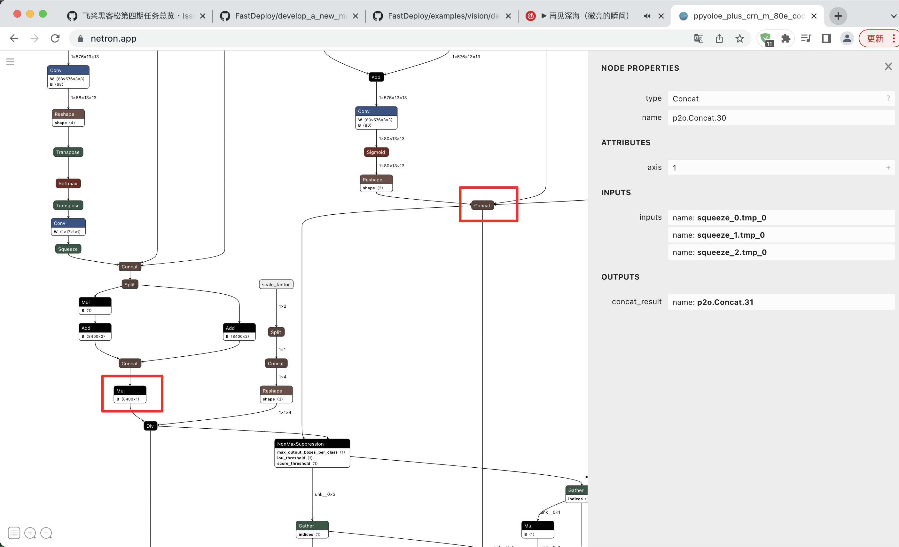

English | [简体中文](./README_CN.md)
# PaddleDetection Horizon Deployment Example

## Supported Models
The following PaddleDetection models have been tested on Horizon:

- PPYOLOE(float32)


## Preparing PaddleDetection Deployment Models and Conversion Models
Before deploying PaddleDetection models on Horizon, you need to convert Paddle models to Horizon models. The specific steps are as follows:

* Convert the Paddle dynamic graph model to the ONNX model. Please refer to the Exporting Model in PaddleDetection and set export.nms=True during conversion.
* Convert the ONNX model to the Horizon model. Please refer to the [conversion document](../../../../../docs/en/faq/horizon/export.md) for conversion.

## Model Conversion Example
### Notes
When deploying PPDetection models on Horizon, the following points should be noted:

* The model export needs to include Decode.
* Since Horizon does not support NMS, the output nodes must be trimmed before NMS.
* Due to the limitations of the Div operator on Horizon, the output nodes of the model need to be trimmed before the Div operator.

### Converting Paddle models to ONNX models
Since the model conversion tool provided by Horizon currently does not support exporting Paddle models directly as Horizon models, it is necessary to first export the Paddle model as an ONNX model, and then convert the ONNX model to a Horizon model.

```bash
# Download the Paddle static graph model and extract it.
wget https://bj.bcebos.com/fastdeploy/models/ppyoloe_plus_crn_m_80e_coco.tgz
tar xvf ppyoloe_plus_crn_m_80e_coco.tgz

# Convert the static graph to ONNX format. Note that the save_file argument should match the name of the compressed model file.
paddle2onnx --model_dir ppyoloe_plus_crn_m_80e_coco \
            --model_filename model.pdmodel \
            --params_filename model.pdiparams \
            --save_file ppyoloe_plus_crn_m_80e_coco/ppyoloe_plus_crn_m_80e_coco.onnx \
            --enable_dev_version True \
            --opset_version 11

# fuse shape
python -m paddle2onnx.optimize --input_model ppyoloe_plus_crn_m_80e_coco/ppyoloe_plus_crn_m_80e_coco.onnx \
                                --output_model ppyoloe_plus_crn_m_80e_coco/ppyoloe_plus_crn_m_80e_coco.onnx \
                                --input_shape_dict "{'image':[1,3,640,640], 'scale_factor':[1,2]}"
```
Since the exported ONNX IR Version may not match Horizon, the ONNX IR Version needs to be manually changed. You can refer to the following Python code:
```python
import onnx
model = onnx.load("ppyoloe_plus_crn_m_80e_coco/ppyoloe_plus_crn_m_80e_coco.onnx")
model.ir_version = 7
onnx.save(model, "ppyoloe_plus_crn_m_80e_coco/ppyoloe_plus_crn_m_80e_coco.onnx")
```
### Model pruning

Due to the differences in Paddle2ONNX versions, the output node names for converted models may vary. To find the correct output node names for the model, you can use Netron to visualize the model and locate the NonMaxSuppression node marked in blue below. The name of the node in the red box is the target name.


For example, after visualizing the model using Netron, you may get the following image:




After finding the NonMaxSuppression node, you can see that the names of the two nodes marked in red are "p2o.Mul.290" and "p2o.Concat.29". Therefore, you need to cut the output up to these two nodes. You can refer to the following Python code to crop the output:

```python 
import argparse
import sys


def parse_arguments():
    parser = argparse.ArgumentParser()
    parser.add_argument(
        '--model',
        required=True,
        help='Path of directory saved the input model.')
    parser.add_argument(
        '--output_names',
        required=True,
        nargs='+',
        help='The outputs of pruned model.')
    parser.add_argument(
        '--save_file', required=True, help='Path to save the new onnx model.')
    return parser.parse_args()


if __name__ == '__main__':
    args = parse_arguments()
    import onnx
    model = onnx.load(args.model)
    output_tensor_names = set()
    for node in model.graph.node:
        for out in node.output:
            output_tensor_names.add(out)

    for output_name in args.output_names:
        if output_name not in output_tensor_names:
            print(
                "[ERROR] Cannot find output tensor name '{}' in onnx model graph.".
                format(output_name))
            sys.exit(-1)
    if len(set(args.output_names)) < len(args.output_names):
        print(
            "[ERROR] There's dumplicate name in --output_names, which is not allowed."
        )
        sys.exit(-1)

    output_node_indices = set()
    output_to_node = dict()
    for i, node in enumerate(model.graph.node):
        for out in node.output:
            output_to_node[out] = i
            if out in args.output_names:
                output_node_indices.add(i)

    # from outputs find all the ancestors
    import copy
    reserved_node_indices = copy.deepcopy(output_node_indices)
    reserved_inputs = set()
    new_output_node_indices = copy.deepcopy(output_node_indices)
    while True and len(new_output_node_indices) > 0:
        output_node_indices = copy.deepcopy(new_output_node_indices)
        new_output_node_indices = set()
        for out_node_idx in output_node_indices:
            for ipt in model.graph.node[out_node_idx].input:
                if ipt in output_to_node:
                    reserved_node_indices.add(output_to_node[ipt])
                    new_output_node_indices.add(output_to_node[ipt])
                else:
                    reserved_inputs.add(ipt)

    num_inputs = len(model.graph.input)
    num_outputs = len(model.graph.output)
    num_nodes = len(model.graph.node)
    print(len(reserved_node_indices), "xxxx")
    for idx in range(num_nodes - 1, -1, -1):
        if idx not in reserved_node_indices:
            del model.graph.node[idx]
    for idx in range(num_inputs - 1, -1, -1):
        if model.graph.input[idx].name not in reserved_inputs:
            del model.graph.input[idx]
    for out in args.output_names:
        model.graph.output.extend([onnx.ValueInfoProto(name=out)])
    for i in range(num_outputs):
        del model.graph.output[0]

    from onnx_infer_shape import SymbolicShapeInference
    model = SymbolicShapeInference.infer_shapes(model, 2**31 - 1, True, False,
                                                1)
    onnx.checker.check_model(model)
    onnx.save(model, args.save_file)
    print("[Finished] The new model saved in {}.".format(args.save_file))
    print("[DEBUG INFO] The inputs of new model: {}".format(
        [x.name for x in model.graph.input]))
    print("[DEBUG INFO] The outputs of new model: {}".format(
        [x.name for x in model.graph.output]))

```
If you name the script mentioned above as prune_onnx_model.py, you can run the following command to prune the model:

```bash
python prune_onnx_model.py --model ppyoloe_plus_crn_m_80e_coco/ppyoloe_plus_crn_m_80e_coco.onnx \
            --output_names p2o.Mul.290 p2o.Concat.29 \
            --save_file ppyoloe_plus_crn_m_80e_coco/ppyoloe_plus_crn_m_80e_coco_cut.onnx
```

Make sure to replace path/to/onnx/model.onnx and path/to/cropped/onnx/model.onnx with the actual paths to your input and output files, respectively.

Great, so the paddle2onnx part is completed. You can refer to the [Export Model Guide](../../../../../docs/en/faq/horizon/export.md) for the process of converting the ONNX model to a Horizon model.


### Configure Conversion of yaml Files


**Modify normalize parameter**

If you need to perform normalize operation on NPU, please configure normalize parameters according to your model, such as:


```yaml
norm_type: 'data_scale'

  # the mean value minused by image
  # note that values must be seperated by space if channel mean value is used
  mean_value: ''

  # scale value of image preprocess
  # note that values must be seperated by space if channel scale value is used
  scale_value: 0.003921568627451
```

At this point, the model conversion is completed and can be deployed directly in FastDeploy.


## Other Links

- [Cpp](./cpp)
- [Visual model prediction results](../../../../../docs/api/vision_results/)