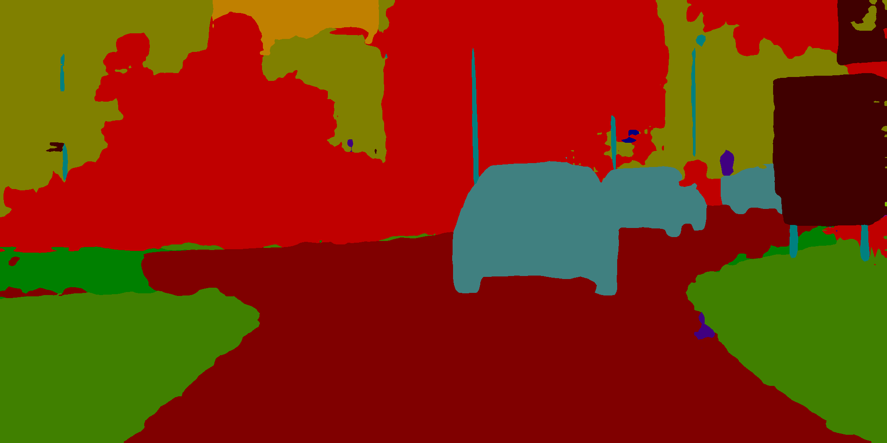

# 图像分割模型库

本文档中模型库均来源于PaddleSeg [release/2.4分支](https://github.com/PaddlePaddle/PaddleSeg/tree/release/2.4)，在下表中提供了部分已经转换好的模型，如有更多模型或自行模型训练导出需求，可参考 [paddleseg模型导出说明](https://github.com/PaddlePaddle/PaddleSeg/blob/release/2.4/docs/model_export.md).
|模型名称|配置文件|模型大小|下载地址|说明|
| --- | --- | --- | --- | ---- |
|BiSeNet|[bisenet_cityscapes_1024x1024_160k.yml](https://github.com/PaddlePaddle/PaddleSeg/blob/release/2.4/configs/bisenet/bisenet_cityscapes_1024x1024_160k.yml)|9.4M|[Paddle模型](https://bj.bcebos.com/paddle2onnx/model_zoo/bisenet.tar.gz) / [ONNX模型](https://bj.bcebos.com/paddle2onnx/model_zoo/bisenet.onnx)| 使用CityScape数据作为训练数据，19个分类，包括车、路、人等等 |
|DANet|[danet_resnet50_os8_cityscapes_1024x512_80k.yml](https://github.com/PaddlePaddle/PaddleSeg/blob/release/2.4/configs/danet/danet_resnet50_os8_cityscapes_1024x512_80k.yml)|190.1M|[Paddle模型](https://bj.bcebos.com/paddle2onnx/model_zoo/danet.tar.gz) / [ONNX模型](https://bj.bcebos.com/paddle2onnx/model_zoo/danet.onnx)| 使用CityScape数据作为训练数据，19个分类，包括车、路、人等等 |
|DeepLabv3|[deeplabv3_resnet50_os8_cityscapes_1024x512_80k.yml](https://github.com/PaddlePaddle/PaddleSeg/blob/release/2.4/configs/deeplabv3/deeplabv3_resnet50_os8_cityscapes_1024x512_80k.yml)|156.6M|[Paddle模型](https://bj.bcebos.com/paddle2onnx/model_zoo/deeplabv3.tar.gz) / [ONNX模型](https://bj.bcebos.com/paddle2onnx/model_zoo/deeplabv3.onnx)| 使用CityScape数据作为训练数据，19个分类，包括车、路、人等等 |
|PP_HumanSeg|[pp_humanseg_lite_export_398x224.yml](https://github.com/PaddlePaddle/PaddleSeg/blob/release/2.4/configs/pp_humanseg_lite/pp_humanseg_lite_export_398x224.yml)|618k|[Paddle模型](https://bj.bcebos.com/paddle2onnx/model_zoo/ppseg_lite_portrait_398x224_with_softmax.tar.gz) / [ONNX模型](https://bj.bcebos.com/paddle2onnx/model_zoo/ppseg_lite_portrait_398x224_with_softmax.onnx)| 人像分割 |


# ONNX模型推理示例

各模型的推理前后处理参考本目录下的infer.py，以BiseNet为例，如下命令即可得到推理结果

```bash
# 安装onnxruntime
pip3 install onnxruntime
# 下载测试图
wget https://paddleseg.bj.bcebos.com/dygraph/demo/cityscapes_demo.png

# 下载BiseNet模型
wget https://bj.bcebos.com/paddle2onnx/model_zoo/bisenet.onnx

python3 infer.py \
    --model_path bisenet.onnx \
    --image_path ./cityscapes_demo.png
```

你也可以使用Paddle框架进行推理验证

```bash
wget https://bj.bcebos.com/paddle2onnx/model_zoo/bisenet.tar.gz
tar xvf bisenet.tar.gz

python3 infer.py \
    --model_path ./bisenet/model \
    --image_path ./cityscapes_demo.png \
    --use_paddle_predict True
```

执行命令后，在 ./outputs/ 下保存可视化结果。

ONNXRuntime 执行效果：

<div align="center">
    
</div>

Paddle Inference 执行效果：

<div align="center">
    
</div>
